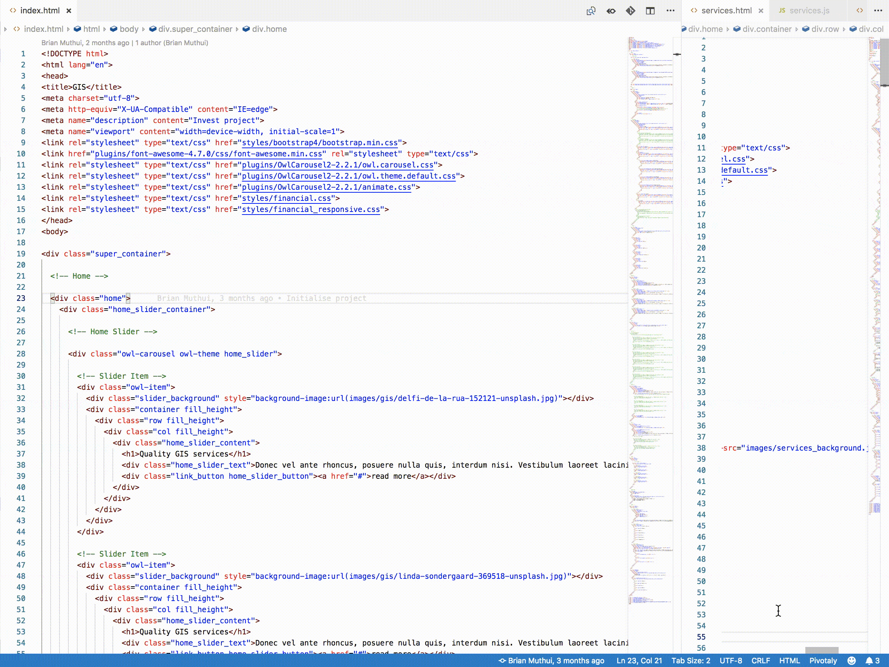
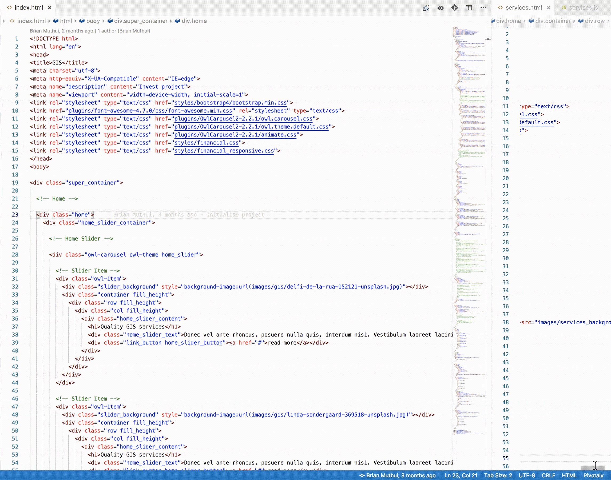

  

# Pivotaly

Pivotaly enables you to keep your work in sync with pivotal tracker without having to switch between the applications. Start, stop, finish and deliver stories that you are working on right from vscode.

## Features
- View story details
    View details of the story you are working on - description, id, name, type, story state, tasks and blockers

- Start stories

    Mark a story as started
- Unstart stories

    Mark a story as unstarted. Implemented as `stop story`
- Finish stories

    Mark a story as finished
- Deliver stories

    Mark a story as delivered
- Deliver and undeliver tasks

    Mark tasks as complete or incomplete
- Resolve and unresolve blockers

    Mark blockers as resolved or unresolved
- Link stories
    
    Assign a story to a git branch

- Member cycle time
    
    View cycle time per members per iteration

#
#### Change story state

#
#### View member cycle time

## Requirements

#### 1. Git (Optional)
Pivotaly can rely on git branches for an efficient flow. i.e. Pivotaly assumes a single pivotal tracker story corresponds to a single git branch.

A story id is prepended or appended to a git branch to link a story to a branch automatically. e.g `ft-edit-read-me-345` will assume `345`  is the story id.

#### 2. Pivotal tracker API token
Pivotaly requires an API token for private pivotal tracker boards.

## Extension Settings

Pivotaly contributes the following settings:

* `pivotaly.protectedBranches`: Array of git branches that are ideally not feature branches e.g. `master`. Pivotaly will not attempt to link a story to git branches added.

* `pivotaly.branchDelimiter`: Delimiter to use to retrieve story ID. e.g. set to `'-'` to get id `345` from `ft-edit-read-me-345` or `'_'` to get `345` from `ft-edit-read-me_345`

## Known Issues

Pivotaly may not track check-outs from bare repositories as expected.

## Release Notes

## [0.5.0]
#### Added
- Editing of already saved Pivotal Tracker token
- Editing of current project
- Dynamic checking of validity of Pivotal Tracker token
- Total number of points per member on member cycletime card
- Reduced download size

#### Fixed
- Need to reload vscode after marking a workspace as not a Pivotal Tracker project
- Erratic messages in member cycle time card if a story was never started

## [0.4.3]
#### Fixed
- Workspaces marked as not pivotal tracker projects still show pivotaly controls after reloading
- Removed `iterations.forEach is not a function` error message when cycle time data is unavailable

## [0.4.2]
#### Added
- Option to mark a workspace as not a pivotal tracker project

## [0.4.1]
#### Fixed
- Erratic checkout detection
- Removed git hooks symlink

## [0.4.0]
#### Added
- Intuitional flow 
    - Pick project id from a list of projects instead of manually inserting a project id
    - Link a story from a list of stories in the current iteration and backlog instead of manually inserting an id

## [0.3.1]
#### Added
- Courtesy message in the sideview when there is no active story

#### Fixed
- Refresh button in sideview not working when story changes

## [0.3.0]
#### Added
- Story information in the sideview
- View description markdown from the sideview
- Ability to mark tasks as complete or incomplete from the sideview
- Ability to mark blockers as resolved or unresolved from the sideview
- Ability to start, stop, finish, deliver and link a story from the side view

#### Fixed
- Member statistics not showing clearly in dark mode

## [0.2.2]
#### Fixed
- Information notifications not showing

## [0.2.1]
#### Added
- Contributions to views
- Option to pick iteration to view member cycle time for

#### Fixed
- Some git repo workspaces registering as non-repositories

## [0.2.0]
#### Added
- Add cycle time per member

#### Fixed
- Links invalid story id

## [0.1.0]
- Support for workspaces that are not git repos

## [0.0.2]
#### Added
- Error message when not in a git repo

#### Fixed
- Doesn't register different project IDs when switching workspaces 

## [0.0.1]
- Initial release
