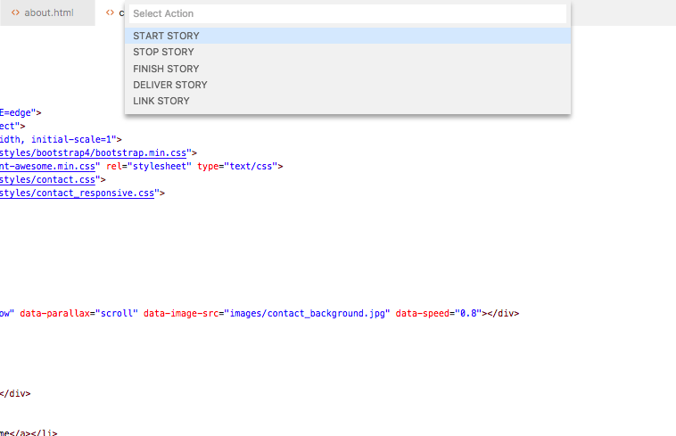

  

# Pivotaly

Pivotaly enables you to keep your work in sync with pivotal tracker without having to switch between the applications. Start, stop, finish and deliver stories that you are working on right from vscode.

## Features

- Start stories

    Mark a story as started
- Unstart stories

    Mark a story as unstarted. Implemented as `stop story`
- Finish stories

    Mark a story as finished
- Deliver stories

    Mark a story as delivered
- Link stories
    
    Assign a story to a git branch

## Requirements

#### 1. Git
Pivotaly relies on git branches for an efficient flow. i.e. Pivotaly assumes a single pivotal tracker story corresponds to a single git branch.

A story id is prepended or appended to a git branch to link a story to a branch automatically. e.g `ft-edit-read-me-345` will assume `345`  is the story id.

#### 2. Pivotal tracker API token
Pivotaly requires an API token for private pivotal tracker boards.

## Extension Settings

Pivotaly contributes the following settings:

* `pivotaly.protectedBranches`: Array of git branches that are ideally not feature branches e.g. `master`. Pivotaly will not attempt to link a story to git branches added.

* `pivotaly.branchDelimiter`: Delimiter to use to retrieve story ID. e.g. set to `'-'` to get id `345` from `ft-edit-read-me-345` or `'_'` to get `345` from `ft-edit-read-me_345`

## Known Issues

Pivotaly may not track check-outs from bare repositories as expected.

## Release Notes

#### [Unreleased]
- Support for multiroot workspaces with multiple git repos
- Statistics per user

## [0.1.0]
- Support for workspaces that are not git repos

## [0.0.2]
#### Added
- Error message when not in a git repo

#### Fixed
- Doesn't register different project IDs when switching workspaces 

## [0.0.1]
- Initial release
